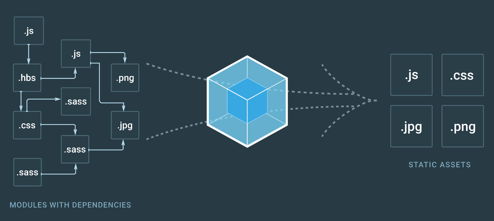

# Webpack Compared

You can understand better why webpack's approach is powerful by putting it into a historical context. Back in the day, it was enough just to concatenate some scripts together. Times have changed, though, and now distributing your JavaScript code can be a complex endeavor.

This problem has escalated with the rise of single page applications (SPAs). They tend to rely on numerous hefty libraries. There are multiple strategies on how to deal with loading them. You could load them all at once. You could also consider loading libraries as you need them. These are examples of strategies you can apply, and webpack supports many of them.

The popularity of Node.js and [npm](https://www.npmjs.com/), the Node.js package manager, provide more context. Before npm became popular, it was difficult to consume dependencies. There was a period of time when people developed front-end specific package managers, but npm won in the end. Now dependency management is easier than before, although there are still challenges to overcome.

## Task Runners and Bundlers

Historically speaking, there have been many build systems. *Make* is perhaps the best known, and it is still a viable option. Specialized *task runners*, such as Grunt, and Gulp were created particularly with JavaScript developers in mind. Plugins available through npm made both task runners powerful and extensible. It is possible to use even npm `scripts` as a task runner. That's common, particularly with webpack.

Task runners are great tools on a high level. They allow you to perform operations in a cross-platform manner. The problems begin when you need to splice various assets together and produce bundles. This is the reason we have *bundlers*, such as Browserify, Brunch, or webpack.

For a while, a solution known as [RequireJS](http://requirejs.org/) was popular. The idea was to provide an asynchronous module definition and build on top of that. The format, AMD, is covered in greater detail later in this chapter. Fortunately, the standards have caught up, and RequireJS seems more like a curiosity now.

There are a couple of developing alternatives as well. I have listed a couple of these below:

* [JSPM](http://jspm.io/) pushes package management directly to the browser. It relies on [System.js](https://github.com/systemjs/systemjs), a dynamic module loader, and skips the bundling step altogether during development. You can generate a production bundle using it. Glen Maddern goes into good detail on his [video about JSPM](https://www.youtube.com/watch?t=33&v=iukBMY4apvI).
* [pundle](https://www.npmjs.com/package/pundle) advertises itself as a next generation bundler and notes particularly its performance.
* [Rollup](https://www.npmjs.com/package/rollup) focuses particularly on bundling ES6 code. A feature known as *tree shaking* is one of its main attractions. It allows you to drop unused code based on usage. Tree shaking is supported by webpack 2 up to a point. You can use Rollup with webpack through [rollup-loader](https://www.npmjs.com/package/rollup-loader).
* [AssetGraph](https://www.npmjs.com/package/assetgraph) takes an entirely different approach and builds on top of tried and true HTML semantics making it highly useful for tasks like [hyperlink analysis](https://www.npmjs.com/package/hyperlink) or [structural analysis](https://www.npmjs.com/package/assetviz).
* [FuseBox](https://github.com/fuse-box/fuse-box) is a bundler focusing on speed. It uses a zero-configuration approach and aims to be usable out of the box.

I'll go through the main options next in greater detail.

## Make

[Make](https://en.wikipedia.org/wiki/Make_%28software%29) goes way back, as it was initially released in 1977. Even though it's an old tool, it has remained relevant. Make allows you to write separate tasks for various purposes. For instance, you might have separate tasks for creating a production build, minifying your JavaScript or running tests. You can find the same idea in many other tools.

Even though Make is mostly used with C projects, it's not tied to it in any way. James Coglan discusses in detail [how to use Make with JavaScript](https://blog.jcoglan.com/2014/02/05/building-javascript-projects-with-make/). Consider the abbreviated code based on James' post below:

**Makefile**

```makefile
PATH  := node_modules/.bin:$(PATH)
SHELL := /bin/bash

source_files := $(wildcard lib/*.coffee)
build_files  := $(source_files:%.coffee=build/%.js)
app_bundle   := build/app.js
spec_coffee  := $(wildcard spec/*.coffee)
spec_js      := $(spec_coffee:%.coffee=build/%.js)

libraries    := vendor/jquery.js

.PHONY: all clean test

all: $(app_bundle)

build/%.js: %.coffee
    coffee -co $(dir $@) $<

$(app_bundle): $(libraries) $(build_files)
    uglifyjs -cmo $@ $^

test: $(app_bundle) $(spec_js)
    phantomjs phantom.js

clean:
    rm -rf build
```

With Make, you model your tasks using Make-specific syntax and terminal commands. This allows it to integrate easily with webpack.

## RequireJS

[RequireJS](http://requirejs.org/) was perhaps the first script loader that became truly popular. It gave us the first proper look of what modular JavaScript at the web could be. Its greatest attraction was AMD. It introduced a `define` wrapper:

```javascript
define(['./MyModule.js'], function (MyModule) {
  // export at module root
  return function() {};
});

// or
define(['./MyModule.js'], function (MyModule) {
  // export as module function
  return {
    hello: function() {...},
  };
});
```

Incidentally, it is possible to use `require` within the wrapper like this:

```javascript
define(['require'], function (require) {
  var MyModule = require('./MyModule.js');

  return function() {...};
});
```

This latter approach definitely eliminates some of the clutter. You will still end up with some code that might feel redundant. Given there's ES6 now, it probably doesn't make much sense to use AMD anymore unless you really must due to legacy reasons.

T> Jamund Ferguson has written a nice blog series on how to port from [RequireJS to webpack](https://gist.github.com/xjamundx/b1c800e9282e16a6a18e).

### UMD

UMD, universal module definition, takes it all to the next level. It is a monster of a format that aims to make the various formats compatible with each other. Check out [the official definitions](https://github.com/umdjs/umd) to understand it in greater detail.

T> Webpack can generate UMD wrappers for you (`output.libraryTarget: 'umd'`). This is particularly useful for package authors. We'll get back to this later in the *Authoring Packages* chapter.

## Grunt


[Grunt](http://gruntjs.com/) was the first popular task runner for front-end developers. Its plugin architecture contributed towards its popularity. Plugins are often complex by themselves. As a result, when configuration grows, it can become difficult to understand what's going on.

Here's an example from [Grunt documentation](http://gruntjs.com/sample-gruntfile). In this configuration, we define a linting and a watcher task. When the *watch* task is run, it will trigger the *lint* task as well. This way, as we run Grunt, we'll get warnings in real-time in our terminal as we edit our source code.

**Gruntfile.js**

```javascript
module.exports = function(grunt) {
  grunt.initConfig({
    lint: {
      files: ['Gruntfile.js', 'src/**/*.js', 'test/**/*.js'],
      options: {
        globals: {
          jQuery: true,
        },
      },
    },
    watch: {
      files: ['<%= lint.files %>'],
      tasks: ['lint'],
    },
  });

  grunt.loadNpmTasks('grunt-contrib-jshint');
  grunt.loadNpmTasks('grunt-contrib-watch');

  grunt.registerTask('default', ['lint']);
};
```

In practice, you would have many small tasks like this for specific purposes, such as building the project. An important part of the power of Grunt is that it hides a lot of the wiring from you.

Taken too far, this can get problematic. It can become hard to thoroughly understand what's going on under the hood. That's the architectural lesson to take from Grunt.

T> Note that the [grunt-webpack](https://www.npmjs.com/package/grunt-webpack) plugin allows you to use webpack in a Grunt environment while allowing you to leave the heavy lifting to webpack.

## Gulp


[Gulp](http://gulpjs.com/) takes a different approach. Instead of relying on configuration per plugin, you deal with actual code. Gulp builds on top of the concept of piping. If you are familiar with Unix, it's the same idea here. You have the following concepts:

* *Sources* to match to files.
* *Filters* to perform operations on sources (e.g., convert to JavaScript)
* *Sinks* (e.g., your build directory) where to pipe your build results.

Here's a sample *Gulpfile* to give you a better idea of the approach, taken from the project's README. It has been abbreviated a notch:

**Gulpfile.js**

```javascript
const gulp = require('gulp');
const coffee = require('gulp-coffee');
const concat = require('gulp-concat');
const uglify = require('gulp-uglify');
const sourcemaps = require('gulp-sourcemaps');
const del = require('del');

const paths = {
  scripts: ['client/js/**/*.coffee', '!client/external/**/*.coffee']
};

// Not all tasks need to use streams.
// A gulpfile is just another node program
// and you can use all packages available on npm.
gulp.task(
  'clean',
  del.bind(null, ['build']
);

gulp.task(
  'scripts',
  ['clean'],
  function() {
    // Minify and copy all JavaScript (except vendor scripts)
    // with sourcemaps all the way down.
    return gulp.src(paths.scripts)
      // Pipeline within pipeline
      .pipe(sourcemaps.init())
        .pipe(coffee())
        .pipe(uglify())
        .pipe(concat('all.min.js'))
      .pipe(sourcemaps.write())
      .pipe(gulp.dest('build/js'));
  }
);

// Rerun the task when a file changes.
gulp.task(
  'watch',
  gulp.watch.bind(null, paths.scripts, ['scripts'])
);

// The default task (called when you run `gulp` from CLI).
gulp.task(
  'default',
  ['watch', 'scripts']
);
```

Given the configuration is code, you can always just hack it if you run into troubles. You can wrap existing Node.js packages as Gulp plugins, and so on. Compared to Grunt, you have a clearer idea of what's going on. You still end up writing a lot of boilerplate for casual tasks, though. That is where some newer approaches come in.

T> [webpack-stream](https://www.npmjs.com/package/webpack-stream) allows you to use webpack in a Gulp environment.

T> [Fly](https://github.com/bucaran/fly) is a similar tool as Gulp. It relies on ES6 generators instead.

## npm `scripts` as a Task Runner

Even though npm CLI wasn't primarily designed to be used as a task runner, it works as such thanks to *package.json* `scripts` field. Consider the example below:

**package.json**

```json
{
  "scripts": {
    "stats": "webpack --env production --profile --json > stats.json",
    "start": "webpack-dev-server --env development",
    "deploy": "gh-pages -d build",
    "build": "webpack --env production"
  },
  ...
}
```

These scripts can be listed using `npm run` and then executed using `npm run <script>`. You can also namespace your scripts using a convention like `test:watch`. The gotcha with this approach is that it takes some care to keep it cross-platform.

Instead of `rm -rf`, you might want to use a utility like [rimraf](https://www.npmjs.com/package/rimraf) and so on. It's possible to invoke other tasks runners here to hide the fact that you are using one. This way you can refactor your tooling while keeping the interface as the same.

## Browserify


Dealing with JavaScript modules has always been a bit of a problem. The language itself didn't have the concept of modules till ES6. Ergo, we have been stuck in the '90s when it comes to browser environments. Various solutions, including [AMD](http://requirejs.org/docs/whyamd.html), have been proposed.

In practice, it can be useful just to use CommonJS, the Node.js format, and let the tooling deal with the rest. The advantage is that you can often hook into npm and avoid reinventing the wheel.

[Browserify](http://browserify.org/) is one solution to the module problem. It provides a way to bundle CommonJS modules together. You can hook it up with Gulp. There are smaller transformation tools that allow you to move beyond the basic usage. For example, [watchify](https://www.npmjs.com/package/watchify) provides a file watcher that creates bundles for you during development. This will save some effort and no doubt is a good solution up to a point.

The Browserify ecosystem is composed of a lot of small modules. In this way, Browserify adheres to the Unix philosophy. Browserify is a little easier to adopt than webpack, and is, in fact, a good alternative to it.

T> [Splittable](https://github.com/cramforce/splittable) is a Browserify wrapper that allows code splitting, supports ES6 out of the box, tree shaking, and more.

## Brunch


Compared to Gulp, [Brunch](http://brunch.io/) operates on a higher level of abstraction. It uses a declarative approach similar to webpack's. To give you an example, consider the following configuration adapted from the Brunch site:

```javascript
module.exports = {
  files: {
    javascripts: {
      joinTo: {
        'vendor.js': /^(?!app)/,
        'app.js': /^app/,
      },
    },
    stylesheets: {
      joinTo: 'app.css',
    },
  },
  plugins: {
    babel: {
      presets: ['es2015', 'react'],
    },
    postcss: {
      processors: [require('autoprefixer')],
    },
  },
};
```

Brunch comes with commands like `brunch new`, `brunch watch --server`, and `brunch build --production`. It contains a lot out of the box and can be extended using plugins.

T> There is an experimental [Hot Module Reloading runtime](https://github.com/brunch/hmr-brunch) for Brunch.

## JSPM


Using JSPM is quite different than earlier tools. It comes with a little CLI tool of its own that is used to install new packages to the project, create a production bundle, and so on. It supports [SystemJS plugins](https://github.com/systemjs/systemjs#plugins) that allow you to load various formats to your project.

Given JSPM is still a young project, there might be rough spots. That said, it may be worth a look if you are adventurous. As you know by now, tooling tends to change quite often in front-end development, and JSPM is definitely a worthy contender.

## Webpack



You could say [webpack](https://webpack.js.org/) takes a more monolithic approach than Browserify. Whereas Browserify consists of multiple small tools, webpack comes with a core that provides a lot of functionality out of the box.

Webpack core can be extended using specific *loaders* and *plugins*. It gives control over how it *resolves* the modules, making it possible to adapt your build to match-specific situations and work-around packages that don't work perfectly out of the box.

## Conclusion

Webpack solves a fair share of common web development problems. If you know it well, it will save a great deal of time although it will take some time to learn to use it. Instead of jumping to a complex webpack based boilerplate, consider spending time with simpler setups first and developing your own. The setups will make more sense after that.
